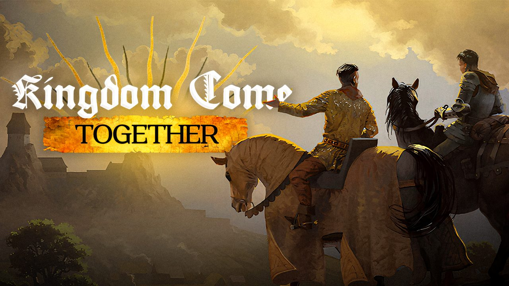

# Testing 0.45.1 (both players)

**Kingdom Come: Together.** Official repository:
https://github.com/DeepFriedDepp/KingdomCome-Together. Unofficial and free; not
affiliated with or endorsed by Warhorse Studios or PLAION.

0.45.1 fixes one thing: **a hit no longer knocks a player down**, and a player's figure
falls on the other screen only when that player dies. One page for the host and the
partner: install, then the checks below. Tick what you saw, write the time next to
anything odd, and send the logs at the end.

**Status:** everything on this page ran in the game solo, against a scripted partner or a
synthetic host (`docs/WO-155-findings.md`); these checks are its first run with two people.
Everything else is as in 0.45.0 (`docs/TEST-0.45.0.md`).

## Install

Both of you: run `KingdomComeTogether-Setup-0.45.1.exe` (the maintainer sends it). It installs
over 0.45.0 and keeps every launcher setting you have. Both computers need it: 0.45.1 refuses
every other version. Afterwards, `tools\Verify-Install.ps1` (if you have it) must end with
"all present".

## What's new in 0.45.1

- **Hits never knock a player down.** An enemy's or an animal's blow takes health and stamina only.
- **A figure falls only on a death**: it lies where it fell until its player respawns; then a
  fresh figure stands where they woke.
- **Friendly fire** still knocks the victim down on his own screen, never twice within 5 seconds;
  on the other screen his figure falls and gets up with the game's own animations.
- **No more T-pose** for a figure after it spawns or gets up.

## Setup (both of you)

The host loads their save and clicks CONNECT, the partner waits at the main menu and clicks
CONNECT there (`mark_join`). **Use throwaway saves only.**

**Markers.** Each check has a one-word marker. When you start it, open the console (`~`) and type
it, for example `mark_hitnofall`. It writes one line into the log so we can find the moment.

## The checks (`docs/TWO-PLAYER-CHECKLIST.md`, WO-155, items 127–131)

1. **Guards on the partner** (`mark_hitnofall`). Let the host's enemies or guards fight the
   partner for ten blows or more. His health drops by each; he is **never knocked down**; the
   host sees his figure standing.
2. **Swinging and blocking** (`mark_hitnofall`). The partner swings and blocks between the blows:
   nothing in the way.
3. **A death on each side** (`mark_deathfall`). The host dies in a fight, then the partner. On the
   other screen the figure falls where he stood and **lies on the ground, not in it**, until he
   respawns; then it vanishes and a fresh figure stands where he woke, in a normal pose.
4. **Friendly fire both ways** (`mark_ffwindow`). Hit each other; hit the same player again 1–2 s
   later and again 8 s later. The victim falls on his own screen and not twice within 5 s (the
   second hit still takes its health); on the attacker's screen the victim's figure falls, lies
   and gets up with the game's own animations.
5. **The figure's pose** (`mark_tpose`). If a figure ever stands with its arms out for more than
   a second, type the marker and note the time.

Anything stuck: "I'm stuck" in the menu (or `mp_unstuck`, then `mp_unstuck hard`), marker
`mark_stuck`. Anything odd: "Something's wrong here" in the menu.

## Logs to send afterwards

Both machines: Report a bug in the launcher. It collects the logs of the six launches before as
well, so a restart does not lose the logs of a crash.
